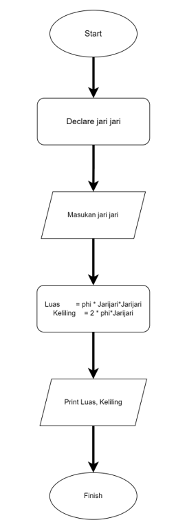
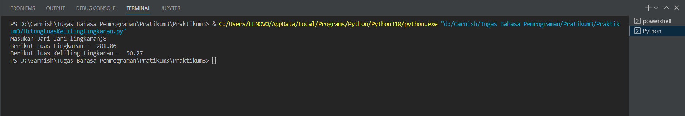

# Menghitung luas dan keliling lingkarn menggunakan `Python`

1. Buat File sesuai kengininan Contoh: HitungLuasKelilingLingkaran.py
2. Berikut Flowchart untuk menghitung luas dan keliling lingkaran

   

3. Lalu Masukan CODE berikut :

    ```python
      # import module math
    import math

    # Variable jariJari menampung nilai input yang dimasukan yaitu berupa string
    jariJari = input('Masukan jari-jari lingkaran :')

    """

    rumus luas & keliling lingkaran
    _____________________________________

    luas     = phi * r^2

    keliling = 2 * phi * r

    _____________________________________

    """

    # convert string to integer
    jariJari = int(jariJari)

    # hitung luas lingkaran
    luas = math.pi * (jariJari * jariJari)

    # hitung luas keliling
    keliling = 2 * math.pi * jariJari

    # output luas & keliling lingkaran
    # .2f => mengambil 2 angka setelah (,)
    print("Berikut Luas lingkaran =  ", format(luas, '.2f'))
    print("Berikut Keliling lingkaran = ", format(keliling, '.2f'))

    ```

4. Ketika diRuning Inputan Jari jari dan Berikut Hasil nya

  

5. Selesai Inilah cara menghitung luas dan keliling Lingkaran# Praktikum3
   
6. # Terimaksih
7. "Garnish Andhika Pratama"